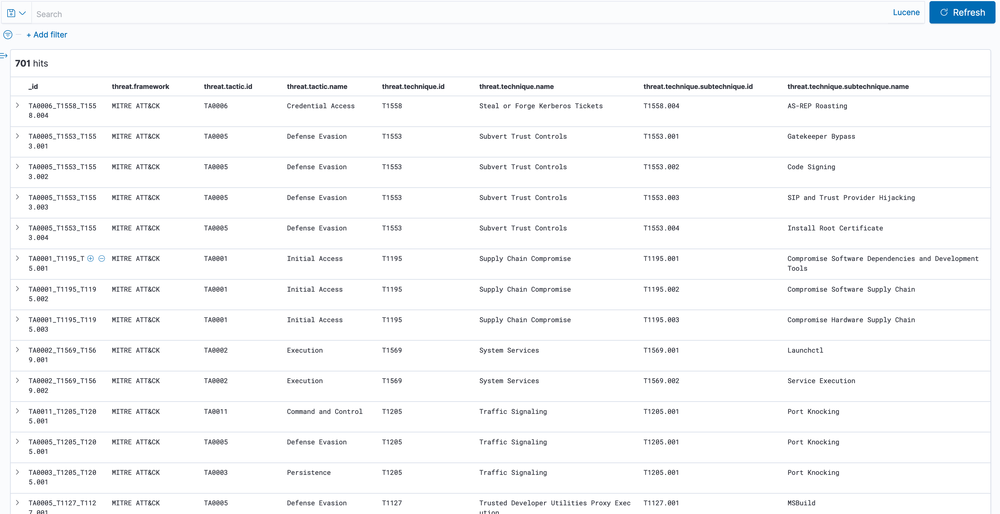

# Import Mitre Attck to Elasticsearch 

## The Python script imports data [Mitre Attck Enterprise matrix](https://attack.mitre.org/matrices/enterprise/) to [Elasticsearch](https://www.elastic.co/elasticsearch/)


- This script uses python3 and pyattck and elasticsearch json libraries.
  - Instructions:
    - Step 1: Install the required libraries
      ```
      pip3 install -r requirements.txt
      ```
    - Step 2: Make changes to the configuration_file.py with your variables
      ```
          "ELASTICSEARCH_USERNAME": "elastic",
          "ELASTICSEARCH_PASSWORD": "PASSWORD",
          "ELASTICSEARCH_HOSTNAME": "elasticsearch_URL:PORT",
          "USE_SSL": True,
          "VERIFY_CERT" : True
      ```
    - Step 3: Run get_mitre.py script
      ```
      python3 get_mitre.py
      ```
      Sample script output:
      ```
      created event TA0008_T1072
      created event TA0008_T1080
      created event TA0008_T1550
      created event TA0003_T1098
      created event TA0003_T1197
      ```
      how it should look in Kibana after the index pattern is created:
      

        